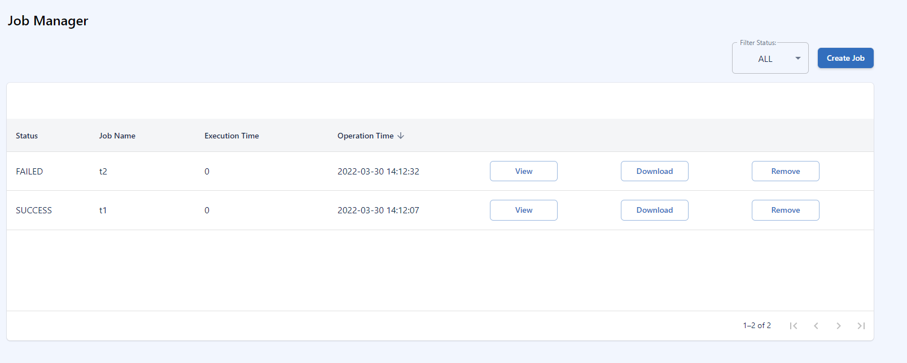

# Datashop Dashboard

## Live Dashboard

live dashboard displays stats about the jobs and services offered by the Datashop platform. It is a good way to get an overview of newly added services and recently finished jobs. it also displays recent developers added to the platform.

{width=60%}

## Profile

Update your profile to let other users know more about yourself.

{width=100%}

click on submit to save your changes.

## Developers

Developers page will display a list of all developers in the platform. You can click on the view button next developer to see their profile in detail

## Data Manager

In the data manager tab you can manage your data. You can add new data sets, delete data sets and also create job requests to process your data.

#### Add new data set
follow the steps below: 

* click on "Upload Data"
* choose a file to upload
* give a name to the datafile
* a description of the datafile 

you also have an option to create new job using "Create Job" next to the datafile. 

{width=100%}

## Service Manager

service manager will display the list of all services in the platform. You can click on the view button next service to read about the service in detail. "developers" can also remove their services by clicking on the "delete" button next to the service. 

#### create a new service
details require to create a service:

* name of the service
* URL link to the service
* A detail description of the service
* service cost
* input requirements to the access the service

{width=100%}

## Job Manager

Job manager will display the list of all jobs run by the user. You can click on the view button next job to display the job results. the "download" button will download results (current we support json/images/csv/.zip files as output).
user can also create jobs by clicking on the "create job" button and selecting a service they like.

#### create a new job
details require to create a job:

* name of the job
* select a service from the list
* select type of input data to the service
* URL link to the data file ("The URL should be publicly accessible")

{width=100%}