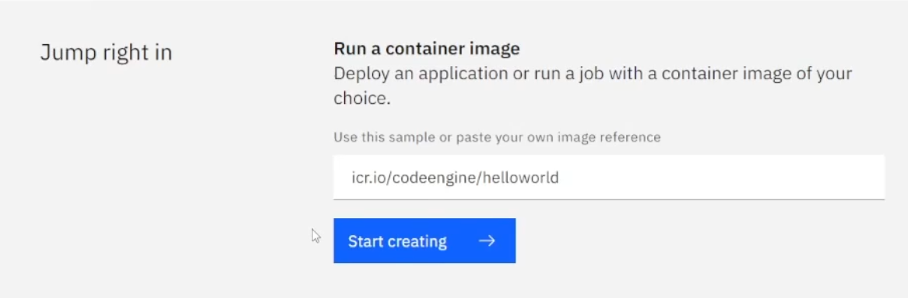
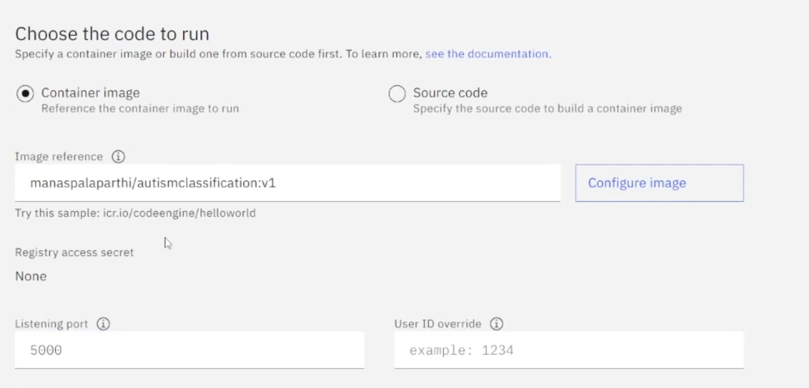

# Deploying image container on IBM Cloud Container hosting Service (code engine)

Ones you have created a Docker image and pushed it to docker hub, you can now deploy it on IBM Cloud Container Service (code engine).

we recommend you watch our video tutorial part 3 to get a better understanding of how to deploy an image on code engine

### login to IBM cloud

steps to follow: 

* click here to login to [IBM cloud](https://cloud.ibm.com/login)

### Code Engine deployment
* navigate to code engine service from the sidebar menu
* Go to projects and select your project or create a new project
* click on "start creating"

{width:80%}

* select name of the container
* select project
* select "choose the run to code" as "image container"
* post the image reference

{width:80%}

* click "create" to create the container.

Wait until the status turns green and "ready"

* copy the container URL and add /predict (api route) 

example:

    https://autismdetectionservice.klm8igvn30j.au-syd.codeengine.appdomain.cloud/predict

The link is the service URL, Use this to create a DataShop service from the [service manager] 