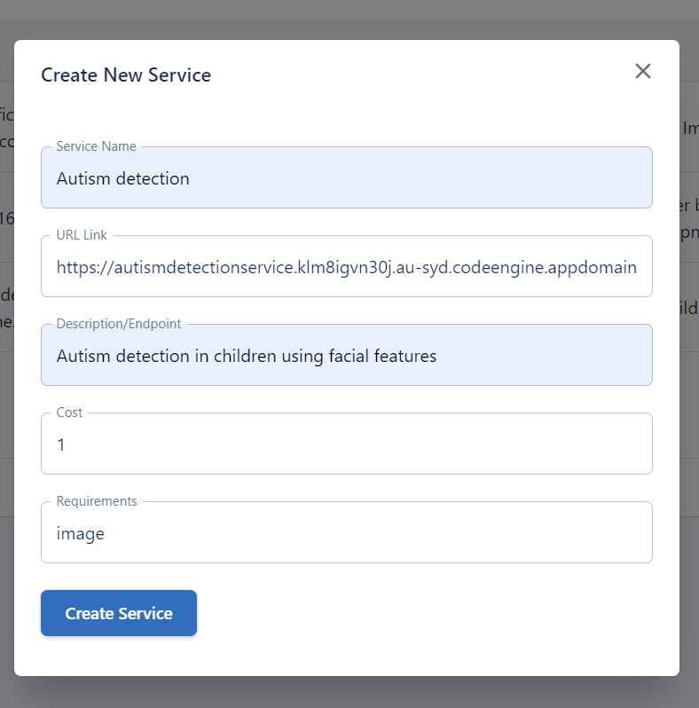

# Create a new service on [Datashop](http://thedatashop.club)

to create a new service on the datashop, you need to register as developer and navigate to "service manager" tab. then click on "createservice" button.

Fill up the following details and click on "create service" button.

* name of the service
* URL link to the service  (IBM code engine container URL)
* A detail description of the service
* service cost
* input requirements to the access the service

{width=100%}

Ones the service is created, you can test the service either from data-manager or from job manager as shown in the Datashop part 3 tutorial. 